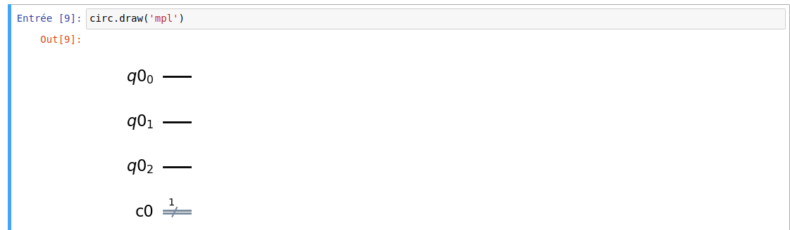

# Electif-quantum

Bienvenue à l'électif Quantum ! Dans ce cours, vous trouverez du matériel d'apprentissage essentiel pour explorer le monde fascinant de la mécanique quantique. Assurez-vous de suivre attentivement les supports de cours et de visionner les vidéos pour une expérience d'apprentissage enrichissante.

## Support de cours
- [Support de cours (Google Drive)](https://drive.google.com/drive/folders/1BNwf3IbPTvmqsQlzmL9gKWQjkDzokMXC?usp=sharing)

## Vidéos
- [Vidéo d'introduction](https://www.youtube.com/watch?v=yCRh_YzCqQw)

## Exercices
Je me suis prêter à tester mes connaissances en mécanique quantique. Voici une série d'exercices pour m'aider à approfondir ma compréhension. Chaque exercice est accompagné d'un GIF pour de la solution.

### Exercice 1 : Porte au Trésor

Description de l'exercice 1...

N'hésitez pas à parcourir les exercices dans l'ordre qui vous convient et à revenir sur les supports de cours et les vidéos au besoin pour vous aider à résoudre les exercices à votre tour.

Bonne exploration de la mécanique quantique !
